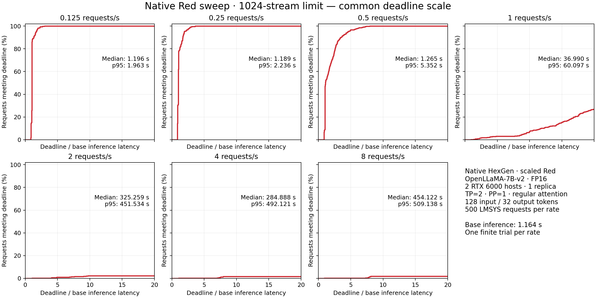

# Native homogeneous RTX result report

Historical measurements from September 21, 2026. These are the completed native
1024-stream Red results. Packaging changes to paths and test fixtures have not
been rerun on GPUs. Earlier custom-server and failed native runs are excluded.

[Download the public results ZIP](results/2026-09-21-rtx6000-red/red-results-no-prompts.zip?raw=true)
or [browse the seven experiment folders](results/2026-09-21-rtx6000-red/).
The ZIP contains exactly 22 files: shared `setup.json` and seven
`requests.csv` / `metrics.json` / `plot.png` triplets. CSVs omit `prompt_text`
for public distribution; request IDs, prompt IDs, success flags and latency values
are unchanged. Folders are numbered `01` through `07` in run order; historical
request IDs retain their original prefixes. The original archive with submitted prompts remains local.

All seven rates completed: 3500/3500 requests. Fresh TP=2 base inference reference: 1.164224 s.

| RPS | Requests | Median latency (s) | p95 latency (s) |
|---:|---:|---:|---:|
| [0.125](results/2026-09-21-rtx6000-red/01_32_0.125_red/) | 500 | 1.196 | 1.963 |
| [0.25](results/2026-09-21-rtx6000-red/02_32_0.25_red/) | 500 | 1.189 | 2.236 |
| [0.5](results/2026-09-21-rtx6000-red/03_32_0.5_red/) | 500 | 1.265 | 5.352 |
| [1](results/2026-09-21-rtx6000-red/04_32_01_red/) | 500 | 36.990 | 60.097 |
| [2](results/2026-09-21-rtx6000-red/05_32_02_red/) | 500 | 325.259 | 451.534 |
| [4](results/2026-09-21-rtx6000-red/06_32_04_red/) | 500 | 284.888 | 492.121 |
| [8](results/2026-09-21-rtx6000-red/07_32_08_red/) | 500 | 454.122 | 509.138 |

The native OCF coordinator with a bounded 1024-stream/512-MiB per-peer HTTP resource override and error-handling corrections, NATS worker coordination, HexGen model partitioning/decoder and original request client were reused. One OpenLLaMA-7B-v2 FP16 replica spans two Quadro RTX 6000 hosts with TP=2 and PP=1 over private Ethernet.

This is a scaled regular-attention starting-point experiment, not a reproduction of the paper's 70B Red numbers. The cross-host topology, GPU type, model, controlled LMSYS subset and reference latency differ. FlashAttention 2.0.8 supplies package components, but its attention kernels are disabled on these Turing GPUs. One finite trial per rate provides no repeat-trial confidence interval; overload latency includes queue drain.

See [README.md](README.md) for server configuration, input preparation, timing
boundaries, source reuse and the twelve runtime changes. The published
[setup](results/2026-09-21-rtx6000-red/setup.json) includes model/data revisions,
frozen runtime hashes, workload policy and the isolated baseline summary.
[Publication checks and file hashes](results/2026-09-21-rtx6000-red/publication-audit.json)
record comparison against the original archive, raw client measurements and both
native ranks. Median, interpolated p95, throughput, deadline attainment and peak
allocated memory were recomputed before publication. Full raw client/rank logs,
prompt text and original audit receipts are retained locally, so the public
export supports latency/SLO analysis but cannot independently replay the full
native inference audit without that evidence.

The measurements support the weekly starting-point deliverable: a live seven-rate Red suite plus an isolated inference reference using the native distributed stack on older RTX 6000 GPUs. At 0.125–0.5 RPS, median end-to-end latency is 1.19–1.27 seconds; at 1 RPS it reaches 36.99 seconds, and at 2–8 RPS delays reach minutes. All 500 requests finishing at a high offered rate does not demonstrate that rate can be sustained indefinitely. The stream-capacity increase removes the earlier admission limit; it does not increase GPU throughput.

At the overloaded rates, client responses arrive in bursts and native rank logs continue advancing between those bursts. The recorded end-to-end metric includes those delivery delays as well as queueing and inference. The 4-RPS median being lower than the 2-RPS median is not a demonstrated improvement: these are single finite runs with different completion timing, and the 4-RPS p95 is worse. No steady-state capacity estimate or causal breakdown of transport delays is claimed.

The overview uses the same deadline range of 0–20 times the 1.164224-second base reference (up to 23.284483 seconds) for every panel. Thus, high-rate curves remain near zero in that view even though all requests eventually succeed. Each experiment’s individual plot shows its full completion-time range. Success here means a valid completed inference response; it is not a measure of linguistic answer quality.

Cleanup verified on both hosts at 16:27 UTC: tracked experiment workers and coordinators exited, temporary private-peer firewall rules removed, no GPU compute processes remain. Leases and server instances were preserved. The monitoring automation was deleted after the authorized suite and cleanup completed.
